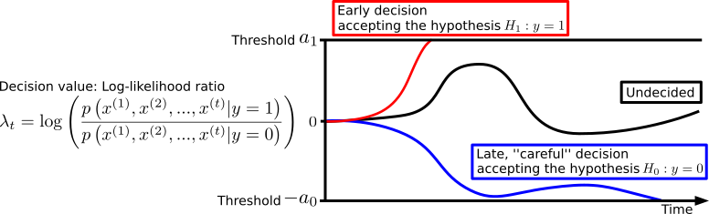
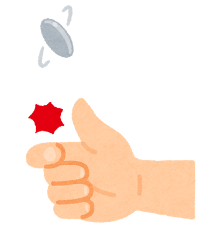
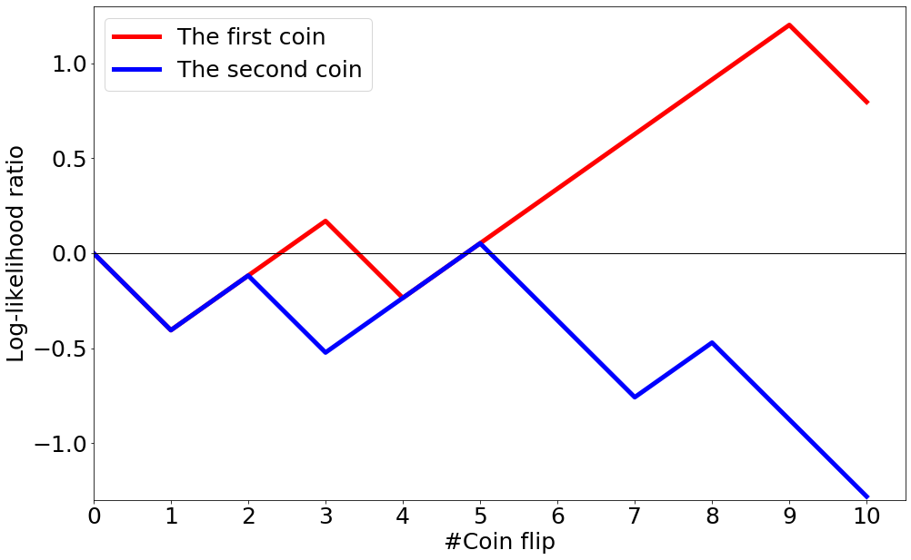
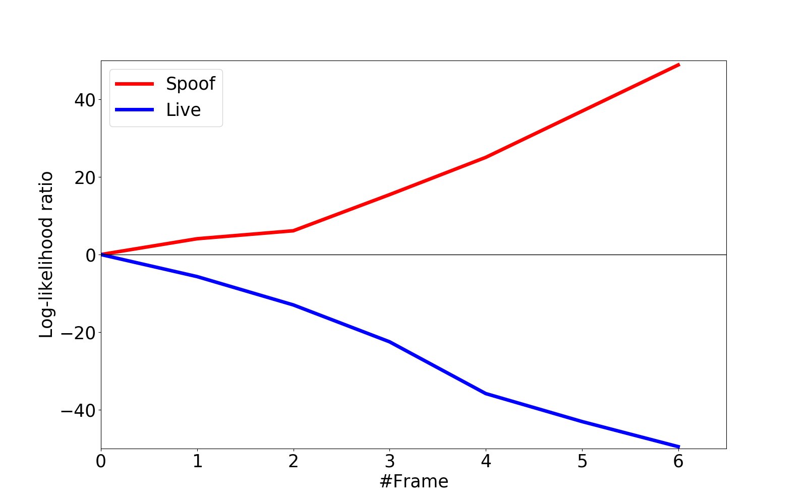
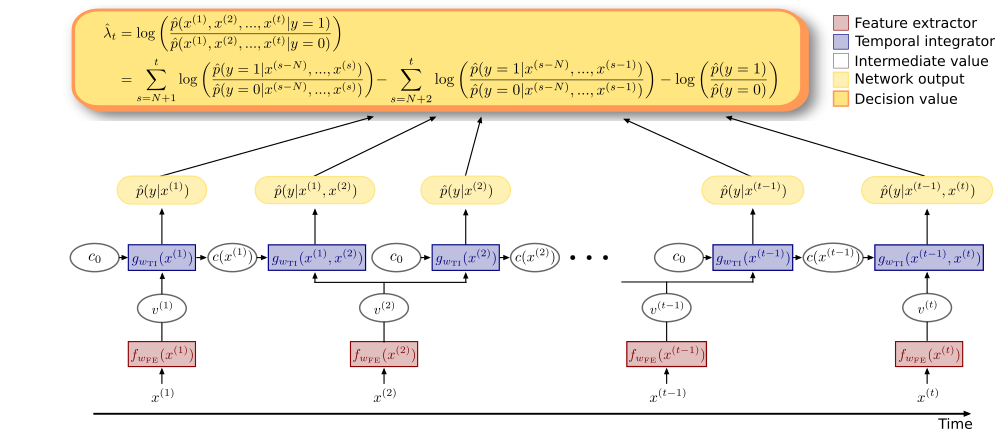

# SPRT-TANDEM: what is it?
A casual introduction to the SPRT-TANDEM algorithm. (under construction)

## Introduction
SPRT-TANDEM is a sequential density ratio estimation algorithm originally proposed in the paper, "Deep Neural Networks for the Sequential Probability Ratio Test on Non-i.i.d. Data Series". The SPRT-TANDEM sequentially estimates log-likelihood ratios of two hypotheses, or classes, for fast and accurate sequential data classification. 

The original paper [1] can be found [here:](https://arxiv.org/abs/2006.05587) 

The tensorflow implementation of the SPRT-TANDEM can be found [here:](https://github.com/TaikiMiyagawa/SPRT-TANDEM)

While the technical details are left to the paper, we provide a casual introduction to our algorithm below.


## Requirements
This article is best read with the Chrome browser with [MathJax Plugin for GitHub](https://chrome.google.com/webstore/detail/mathjax-plugin-for-github/ioemnmodlmafdkllaclgeombjnmnbima?hl=en)


## Problem setting
Imagine you have a sequential data,  

\begin{align*}
X^{(1,T)} := \lbrace x^{(1)}, x^{(2)}, ..., x^{(t)}, ..., x^{(T)} \rbrace,  
\end{align*}

where $x^{(t)}$ is a data sample, such as a video frame, an audio signal, a neural firing rate, etc. The sequential data $X^{(1,T)}$ has an associated binary label $y\in\{1,0\}$ that indicates a class to which the sequential data belong. Your task is to correctly estimate the class label $y$, with a minimal number of data samples possible (say, $k < n$ samples). Generally speaking, there is a trade-off between speed (i.e., small data samples) and accuracy (i.e., a correct estimate of the label): using fewer samples tend to increase the misclassification rate, while highly accurate classification requires more data samples. Thus, it is a non-trivial problem.

## Sequential Probability Ratio Test
One algorithm that provides a solution to the above tradeoff problem is the Sequential Probability Ratio Test, or SPRT, which was originally invented by Abraham Wald [5, 6]. The SPRT calculates the log-likelihood ratio (LLR) of two competing hypotheses (i.e., $y=1$ v.s. $y=0$) and updates the LLR every time a new sample is acquired until the LLR reaches one of the two thresholds for alternative hypotheses.

<div align="center">

</div>

As the schematic figure above shows, for data that is easy to classify, the SPRT outputs an answer taking a few samples, whereas, for difficult data, the SPRT takes in numerous samples in order to make a ``careful'' decision. Importantly, Wald and his colleagues proved that when sequential data are sampled from independently and identically distributed (i.i.d.) data, SPRT can minimize the required number of samples to achieve the desired upper-bounds of false positive and false negative rates comparably to the Neyman-Pearson test, known as the most powerful likelihood test [4, 6].  
    Thus, we would like to use the SPRT whenever possible for solving the sequential classification problem. Below we will see how the SPRT can be applied to a real problem.

## Example 1: coin flipping
Let's start with a toy example to get the hang of the SPRT.  

<div align="center">

</div>

You have two coins, but one of them is a skewed coin that has uneven probabilities of generating head or tail when it is flipped:

$\text{coin A (unbiased): } y=0$
\begin{gather*}
\begin{cases}
  p(x^{(t)} | y=0) = \frac{1}{2} & \text{if } x^{(t)} = x_{head} \newline
  p(x^{(t)} | y=0) = \frac{1}{2} & \text{if } x^{(t)} = x_{tail}
\end{cases}
\end{gather*}

$\text{coin B (biased): } y=1$
\begin{gather*}
\begin{cases}
  p(x^{(t)}| y=1) = \frac{1}{3} & \text{if } x^{(t)} = x_{head} \newline
  p(x^{(t)}| y=1) = \frac{2}{3} & \text{if } x^{(t)} = x_{tail}
\end{cases}
\end{gather*}

You do not know which one is the coin A: the true label $y$ of the coins are unknown. Now, you want to experiment with the two coins to make a guess on the labels, assuming that each flipping trial can be considered as independent. Flipping each of them ten times yields the following results.

The first coin:
\begin{align*}
    X_{1}^{(1, 10)} = \lbrace x_{head}, x_{tail}, x_{tail}, x_{head}, x_{tail}, x_{tail}, x_{tail}, x_{tail}, x_{tail}, x_{head} \rbrace
\end{align*}

The second coin:
\begin{align*}
    X_{2}^{(1, 10)} = \lbrace x_{head}, x_{tail}, x_{head}, x_{tail}, x_{tail}, x_{head}, x_{head}, x_{tail}, x_{head}, x_{head} \rbrace
\end{align*}


you have two hypotheses:  

\begin{align*}
    &H_0: y=0 \text{   (It is the coin A.)} \newline
    &H_1: y=1 \text{   (It is the coin B.)}
\end{align*}

Luckily, in thie example you can calculate the exact log-likelihood ratio for $X_{1}^{{1, 10}} $ and $X_{2}^{{1, 10}}$ easily, because (i) you already know the probabilities of being head or tail, and (ii) each flipping trial can be handled as independent:

\begin{align*}
  \mathrm{LLR}(X_1^{(1,10)}) 
   := & \log \left(
        \frac{p(X_{1}^{(1,10)} | y=1)}
             {p(X_{1}^{(1,10)} | y=0)} 
    \right) \newline
    = & \sum_{t=1}^{10} \log \frac{p( x_1^{(t)} | y=1)} {p( x_1^{(t)} | y=0)} \newline
    = & \log \left( \frac{ \frac{1}{3} } { \frac{1}{2} } \right) + \log \left(\frac{ \frac{2}{3} } { \frac{1}{2} } \right) + \log\left( \frac{ \frac{2}{3} } { \frac{1}{2} } \right) + \log\left( \frac{ \frac{1}{3} } { \frac{1}{2} } \right) + \log\left(\frac{ \frac{2}{3} } { \frac{1}{2} } \right) \newline
    + &\log\left(\frac{ \frac{2}{3} } { \frac{1}{2} } \right) + \log\left(\frac{ \frac{2}{3} } { \frac{1}{2} } \right) + \log\left(\frac{ \frac{2}{3} } { \frac{1}{2} } \right) + \log\left(\frac{ \frac{2}{3} } { \frac{1}{2} } \right) + \log\left(\frac{ \frac{1}{3} } { \frac{1}{2} }\right) \newline
    =
    \approx & 0.80
\end{align*}

Note that flipping trials are independent. Thus, the first coin is likely to be coin A, while the second coin is coin B.

<div align="center">

</div>


## Example 2: face spoofing detection
\subsection{Example 2: face spoofing detection}
Next, let's consider a more realistic scenario: face spoofing detection. Face spoofing detection is one of the biometrics task classifying a facial image into a live face class, or a spoof face class (e.g., a facial photo, a face displayed on a screen, a face mask).\\

In this example, you are presented with a series of facial image to choose one of the two hypotheses,\\

$H_0$: It is a live face. \\
$H_1$: It is a spoof face. \\ 

Now let's see an example. 

<div align="center">


</div>

Here, you are confronting with two problems executing the SPRT. First, unlike the coin-flipping example, you do not know the generating probability of the given data. Second, the video frames are highly correlated, and the assumption of the original SPRT no longer holds. These two problems hamper calculating the likelihood ratio.

## SPRT-TANDEM for the likelihood estimation
So what should we do? Here comes the SPRT-TANDEM algorithm. We use two kinds of density ratio estimation algorithms, ratio matching approach, and probabilistic classification approach, to let a deep neural network estimate the likelihood ratio. To control a correlation length that is considered, we propose the TANDEM formula:

\begin{align*}
    &\ \log \left(
        \frac{p(x^{(1)},x^{(2)}, ..., x^{(t)}| y=1)}{p(x^{(1)},x^{(2)}, ..., x^{(t)}| y=0)}
    \right)\nonumber \newline
    = &\sum_{s=N+1}^{t} \log \left( 
        \frac{
            p(y=1| x^{(s-N)}, ...,x^{(s)})
        }{
            p(y=0| x^{(s-N)}, ...,x^{(s)})
        }
    \right) - \sum_{s=N+2}^{t} \log \left(
        \frac{
            p(y=1| x^{(s-N)}, ...,x^{(s-1)})
        }{
            p(y=0| x^{(s-N)}, ...,x^{(s-1)})
        }
    \right) \nonumber \newline
     & - \log\left( \frac{p(y=1)}{p(y=0)} \right) 
\end{align*}

Our proposed neural network is trained to explicitly calculate the TANDEM formula to provide the sequential likelihood ratio estimation. Below is the estimated likelihood trajectories of example 2.

<div align="center">

</div>

The conceptual figure of the proposed neural network is presented below. The network explicitly calculate the TANDEM formula. At the training phase, we adopted a novel loss function, LLLR, to minimize Kullback-Leibler Divergence [3] between the estimated and the true LLRs.  

<div align="center">

</div>

## SPRT as an algorithm of the brain
The SPRT algorithm makes an early decision for an easy data series, while it takes time to make a decision on a difficult data. This is quite in line with our daily mental process - the more difficult a problem is, the longer time we require for decision making. Indeed, the SPRT seems to be the best algorithm explaining neural activities in the primate brain. Kira et al. [2] found that neurons in the part of the primate brain called the lateral intraparietal cortex (LIP) showed neural activities reminiscent of the SPRT; when a monkey sequentially collecs random pieces of evidence to make a binary choice, LIP neurons show activities proportional to the LLR. Note that the presented stimuli are distributed i.i.d.; thus, it remains an open question if the brain uses the SPRT-TANDEM for correlated data or uses some other algorithm. 

## Citation
Please cite the paper if you find our work is useful:
```
@misc{SPRT_TANDEM2020,
    title={Deep Neural Networks for the Sequential Probability Ratio Test on Non-i.i.d. Data Series},
    author={Akinori F. Ebihara and Taiki Miyagawa and Kazuyuki Sakurai and Hitoshi Imaoka},
    year={2020},
    eprint={2006.05587},
    archivePrefix={arXiv},
    primaryClass={cs.LG}
}
```

## References
[1] A. F. Ebihara, T. Miyagawa, K. Sakurai, and H. Imaoka. Deep neural networks for the sequential probability ratiotest on non-i.i.d. data series, arXiv, 2020

[2] S. Kira, T. Yang, and M. N. Shadlen. A neural implementation of wald’s sequential probability rato test. Neuron, 85(4):861–873, Feb. 2015.

[3] S. Kullback and R. A. Leibler. On information and sufficiency.Ann. Math. Statist., 22(1):79–86, 03 1951.

[4] A. Tartakovsky,  I. Nikiforov,  and M. Basseville.Sequential Analysis: Hypothesis Testing and ChangepointDetection. Chapman & Hall/CRC, 1st edition, 2014.

[5] A. Wald. Sequential tests of statistical hypotheses. Ann. Math. Statist., 16(2):117–186, 06 1945.

[6] A. Wald.Sequential Analysis. John Wiley and Sons, 1st edition, 1947.

